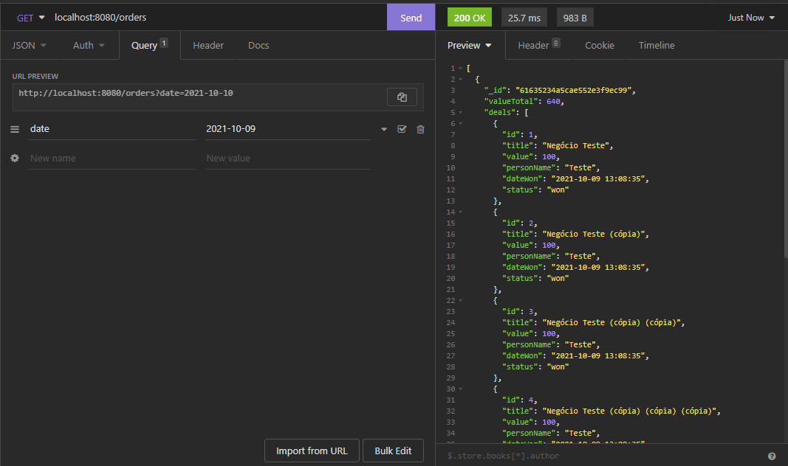
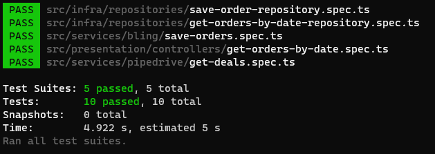

<p align="center">
  <a href="https://www.linkapi.solutions" target="blank"></a>
</p>

[circleci-image]: https://img.shields.io/circleci/build/github/nestjs/nest/master?token=abc123def456

## 📃 Descrição
O objetivo desse projeto é realizar a integração entre o 
[CRM Pipedrive](https://www.pipedrive.com/pt/) com o [ERP Bling](https://www.bling.com.br/) e salvar os dados em uma base de dados [Mongodb](https://www.mongodb.com/).

## 📋 Funcionalidades
O projeto possui uma rotina para pegar os dados do Pipedrive e salvar no banco de dados e no Bling. O worker está em <code>src/main/workers</code>.

Também possui uma API na qual é possível pegar os dados dos pedidos consolidadas por dia.

## 📖 Documentação
Para listar os pedidos salvos basta acessar o endpoint <code>/orders</code> com o método <code>GET</code>. É necessário informar uma data para pegar os dados consolidados de um determinado dia. Para isso, basta informar um <code>date (YYYY-MM-DD)</code> como <code>query param</code>.


<br>
Para garantir a consistência da aplicação e também servir como documentação das regras foi desenvolvido <code>testes unitários</code>.


## 🛠 Ferramentas

- [NestJS](https://nestjs.com/)
- [TypeScript](https://www.typescriptlang.org/)
- [MongoDB](https://www.mongodb.com/)
- [Jest](https://jestjs.io/pt-BR/)

## 🚀 Rodando a aplicação

É necessário ter instalado na sua máquina

- [NodeJS](https://nodejs.org/en/)
- [Git](https://git-scm.com/)
- [Npm](https://www.npmjs.com/)

```bash
# clone a aplicação

$ git clone https://github.com/jeversonjv/pipe-bling.git

# entre na pasta

$ cd pipe-bling

# crie seu arquivo .env e adicione a URL e APIKEY do Pipedrive e Bling. Também adicione a URL do Mongodb.

$ cp .env.example .env

# rode a aplicação

$ npm run start

# Pronto, agora a aplicação estará rodando na porta 8080 ou outra especificada
```

## 👦 Autor

Desenvolvido por <b>Jeverson Gonçalves</b> 👊😎👊 <br /><br />
<a href="https://github.com/jeversonjv">
 
</a>

[](https://www.linkedin.com/in/jeverson-gon%C3%A7alves-6612a214b/)

[](mailto:jeversontp@gmail.com)

## 📑 Licença

O projeto é [MIT](https://github.com/jeversonjv/pipe-bling/blob/master/LICENSE).
